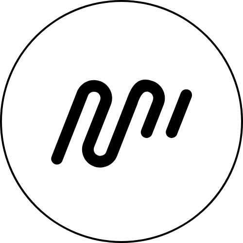
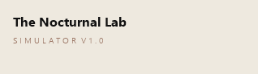

# Hi, I'm Jason

Computer Science student at De La Salle University - Dasmarinas, specializing in Intelligent Systems. I build web apps, desktop prototypes, and AI-adjacent tools, then package them with clean documentation for internship review.

  

## What I'm Focused On

- Software, web development, networking/systems, and security-adjacent internships
- Database-backed apps, safe public demos, and prototype cleanup
- Clear technical documentation for teams and reviewers

## View My Portfolio

  

[Portfolio](https://jason-bongon.vercel.app)

## Featured Work

  
   
  <strong>SimPathy Frontend Demo</strong>
   
  Frontend-only thesis demo for virtual-patient communication practice, using safe mock data instead of the private backend.
   
  <a href="https://github.com/J0v1t/simpathy-demo">Repository</a> | <a href="https://simpathy-demo.vercel.app">Live demo</a>

 

  
   
  <strong>MyRhythm Desktop Prototype</strong>
   
  Sanitized PyQt prototype exploring emotion-aware music recommendation with local preferences, FER, heart-rate modules, and safe asset policies.
   
  <a href="https://github.com/J0v1t/myrhythm-desktop-prototype">Repository</a>

 

  
   
  <strong>DetailDash POS Prototype</strong>
   
  Flask and SQLite car-wash POS workflow with auth, inventory CRUD, API routes, transactions, screenshots, and setup notes.
   
  <a href="https://github.com/J0v1t/detaildash-pos-prototype">Repository</a>

 

  
   
  <strong>Automata Simulator</strong>
   
  Team-built Automata Theory web app with DFA, CFG, and PDA simulation workflows.
   
  <a href="https://github.com/harleneee/AutomataSimulator">Repository</a> | <a href="https://automata-simulator-amber.vercel.app">Live demo</a>

