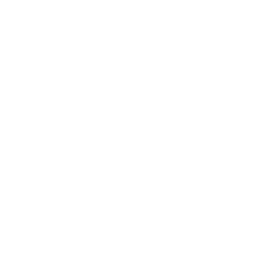

# Hi, I'm Jason

Computer Science student at De La Salle University - Dasmarinas, specializing in Intelligent Systems. I build web apps, desktop prototypes, and AI-adjacent tools, then package them with clean documentation for internship review.

  
  
  
  
  
  

## What I'm Focused On

- Software, web development, networking/systems, and security-adjacent internships
- Database-backed apps, safe public demos, and prototype cleanup
- Clear technical documentation for teams and reviewers

## Featured Work

| Project | What it shows |
| --- | --- |
|  [SimPathy Frontend Demo](https://simpathy-demo.vercel.app) | Frontend-only thesis demo for virtual-patient communication practice, using safe mock data instead of the private backend. |
|  [DetailDash POS Prototype](https://github.com/J0v1t/detaildash-pos-prototype) | Flask and SQLite car-wash POS workflow with auth, inventory CRUD, API routes, transactions, screenshots, and setup notes. |
|  [MyRhythm Desktop Prototype](https://github.com/J0v1t/myrhythm-desktop-prototype) | Sanitized PyQt prototype exploring emotion-aware music recommendation with local preferences, FER, heart-rate modules, and safe asset policies. |
| [Automata Simulator](https://github.com/harleneee/AutomataSimulator) | Team-built Automata Theory web app. My contribution focused on the PDA simulator, tape/stack output, transition history, and accept/reject states. |

## Public Notes

Most of these are academic or prototype projects prepared as internship proof material. I keep original working repositories private when they contain school-only files, datasets, generated artifacts, secrets, or unfinished development history.
